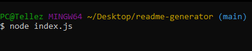

# README Generator

## Description
This is a application that was made with just JavaScript and Node.js which helps users generate a README file. It is currently going to generate under 'usertemp.md' instead of the usaul 'README.md' for overwriting issues.

## Installation
 
1. Users will copy the SSH key and clone within their terminal to access the contents.
2. Once cloned , users must install node.js in order to access the questions part of the README generator.
3. Once users installed node.js, they now have to go to their terminal and type in ' npm install ' to install to their local system.
4. Once installed , users can now open their terminal and type in ' node index.js ' which will allow users to access the questions that will generate their README.md.
5. Users will go through the series of question and once completed, a confirmation message of 'Succesfully Made' will appear.
6. Users can now acces their filled out README by going to 'usertemp.md' and their answers to the promt will be their and filled.

## Visuals

 refers to step 3

 refers to step 4

 refers to step 5

.png)

 refers to step 6 to complete README file

## License 
[MIT](./license.md)